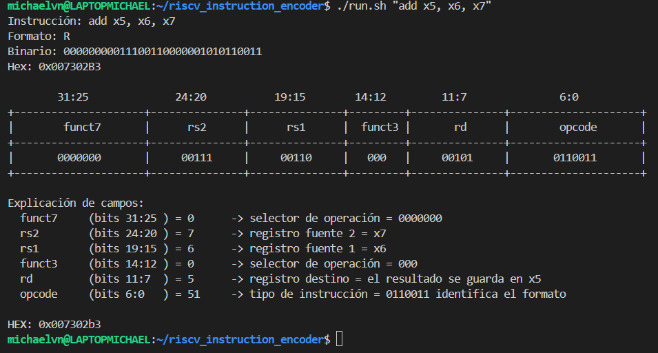
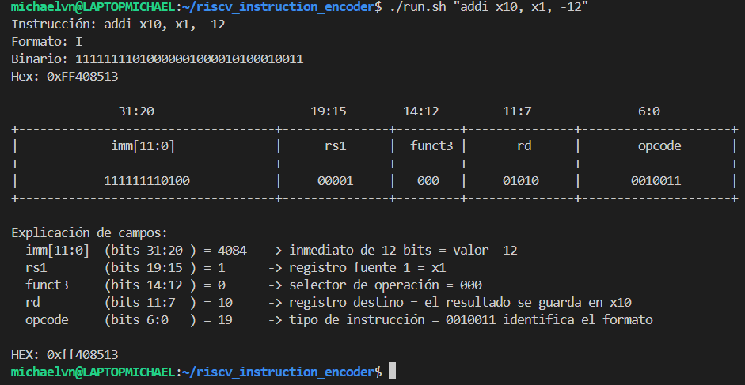
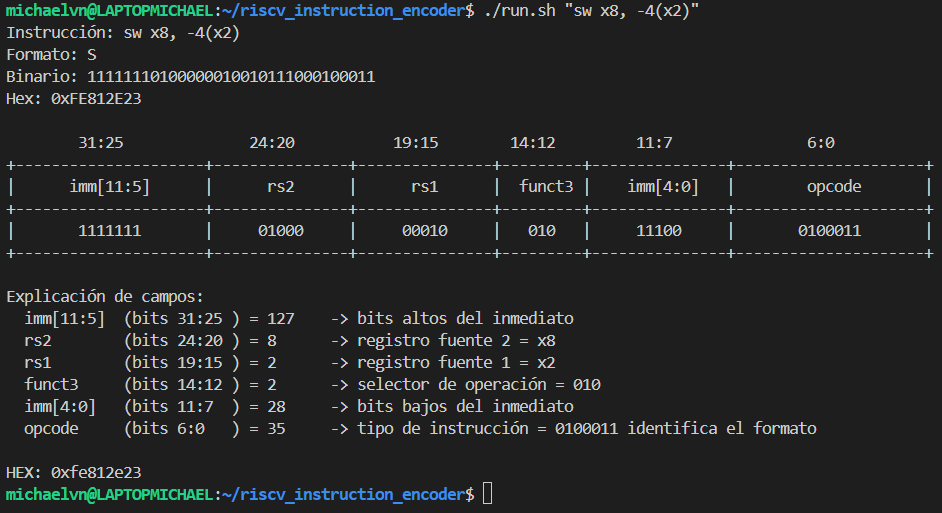
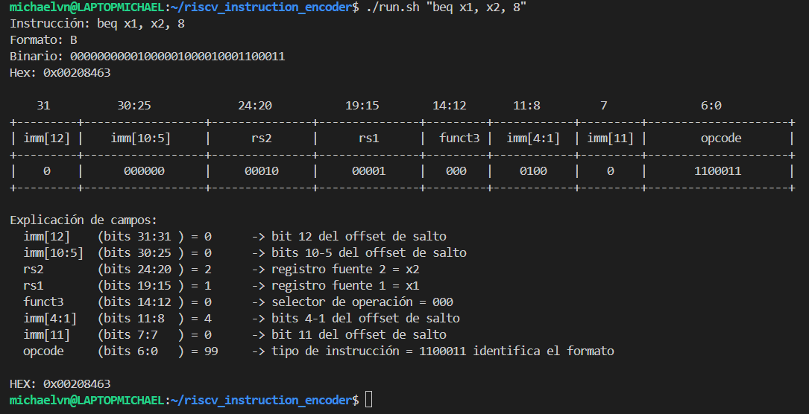
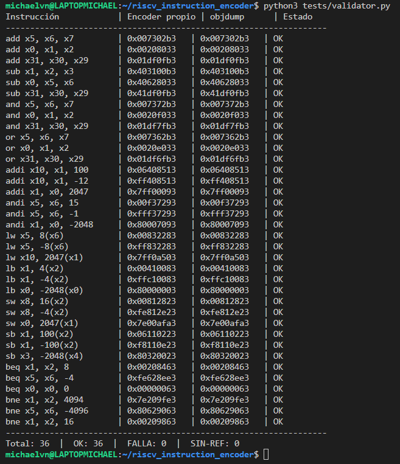

# Documentación Técnica — Codificador Educativo de Instrucciones RISC-V

**Curso:** CE-4301 Arquitectura de Computadores I
**Proyecto Individual — 2026-II**
**Autor:** Michael Valverde Navarro 

---

## 1. Arquitectura del código y decisiones de diseño

La herramienta traduce una única instrucción del subconjunto RV32I a su
codificación de 32 bits y muestra un desglose visual de sus campos. A
continuación se describe la arquitectura, las decisiones y justificaciones de diseño.

### 1.1. Diseño dirigido por tablas de datos

El núcleo de la herramienta desarrollada son tres diccionarios que separan los datos
de la lógica. Esta fue una decisión deliberada, en lugar de repartir los
valores de codificación por el código con condicionales, se concentran en
tablas, de modo que la lógica de codificación es genérica y las tablas son
la única fuente de verdad.

- `INSTRUCTIONS`: mapea cada mnemónico a su formato (`inst_type`) y sus
  campos fijos (`opcode`, `funct3`, y `funct7` donde aplica). Este
  diccionario cumple dos funciones clave: primero, permite decidir
  de qué tipo es la instrucción (consultando `inst_type`), lo que dirige
  el despacho al codificador correcto; y segundo, provee los valores de
  codificación sin que estén escritos "a mano" en cada función.

- `FIELDS`: define, por cada formato, qué rango de bits ocupa cada
  campo. Al saber el formato, la herramienta sabe qué operandos y qué
  campos tiene disponibles para trabajar, y puede decodificar el word
  recorriendo esta tabla en lugar de tener lógica separada por formato.

- `ROLES`: texto explicativo de cada campo para la salida de cada elemento que forma la instrucción.
  Al estar separado de la lógica, los textos se mantienen en un solo lugar
  y se reutilizan entre formatos (p. ej. `rd` significa lo mismo en R y en I).

La ventaja de este enfoque: agregar o corregir una instrucción es editar
una tabla, no tocar la lógica de codificación.

### 1.2. Un tipo intermedio para las cargas

Las instrucciones `lw` y `lb` pertenecen al formato I en cuanto a cómo
se ensamblan sus bits (inmediato de 12 bits en [31:20], igual que `addi`).
Sin embargo, su sintaxis de operandos es distinta, se escriben como
`lw rd, offset(rs1)` en lugar de `addi rd, rs1, imm`.

Para manejar esta diferencia se introdujo un tipo intermedio, `IL`
(I-Load), en la tabla `INSTRUCTIONS`. La decisión clave es que `IL`
distingue el parseo, no el ensamblado: las cargas se parsean con
`parse_memory` (para separar el `offset(rs1)`), pero una vez obtenidos los
campos, se ensamblan exactamente igual que una instrucción I. Esto evita
duplicar la lógica de ensamblado y mantiene explícito que la carga es un
caso especial *solo* en cómo se leen sus operandos.

### 1.3. Un codificador por formato

Se implementó una función de codificación independiente por cada
formato (`encode_r_type_inst`, `encode_i_type_inst`,
`encode_il_type_inst`, `encode_s_type_inst`, `encode_b_type_inst`) en
lugar de una única función con condicionales internos.

Esta es la decisión de diseño más importante en cuanto a organización. 
Cada formato ensambla sus campos de manera distinta, en especial
el inmediato, que va contiguo en I, partido en S, y partido y desordenado
en B. Tener una función por formato es la opción más limpia y ordenada
para este tipo de herramienta pues cada formato se puede probar y depurar de forma aislada, sin riesgo
de romper otro. El código de cada función refleja directamente el layout de su formato, sin ramificaciones que mezclen la lógica de varios y la función `encode_instruction` queda como un despachador simple que parsea, consulta el formato en `INSTRUCTIONS`, y manda al codificador correspondiente.

### 1.4. Parsers separados por responsabilidad

Siguiendo el mismo principio de una responsabilidad por función, el parseo
se dividió en funciones especializadas en lugar de un único parser que lo
resolviera todo:

- `parse_instruction`: separa el mnemónico de la lista de operandos,
  tolerando espacios variables y comas con o sin espacio.
- `parse_register`: convierte un registro (`"x5"`) a su número,
  validando que exista.
- `parse_imm`: convierte y valida un inmediato de tipo I.
- `parse_imm_type_b`: convierte y valida un inmediato de tipo B, que
  tiene un rango distinto y una restricción de paridad propia.
- `parse_memory`: separa un operando de memoria `offset(reg)` en sus
  dos piezas, reutilizando `parse_register` para la parte del registro.

La razón de separar el parseo de registros, offsets de memoria e
inmediatos en funciones distintas es que cada uno tiene reglas de
validación diferentes y aparece en combinaciones distintas según el
formato. Separarlos evita un parser monolítico con casos especiales
enredados, y permite que unos reutilicen a otros (p. ej. `parse_memory`
usa `parse_register`).

### 1.5. Manejo del inmediato y operaciones de bits

- R: sin inmediato.
- I / IL: inmediato de 12 bits contiguo en [31:20]; negativos en
  complemento a 2 mediante `& 0xFFF`.
- S: inmediato de 12 bits partido en `imm[11:5]` ([31:25]) e
  `imm[4:0]` ([11:7]).
- B: inmediato de 13 bits (bit 0 implícito), partido y colocado
  desordenado: `imm[12]` en bit 31, `imm[10:5]` en [30:25],
  `imm[4:1]` en [11:8], `imm[11]` en bit 7.

En todos los casos se usan las mismas operaciones de bits: desplazamiento
(`<<`, `>>`) para posicionar/alinear, máscara (`&`) para recortar al ancho
del campo, y OR (`|`) para combinar los campos sin solaparse.

### 1.6. Validación y casos límite contemplados

La herramienta valida activamente los rangos, y estos límites están
contemplados tanto en el código como en los casos de prueba:

- Inmediatos de tipo I y S: rango −2048 a 2047 (12 bits con signo). Un
  valor fuera de rango se rechaza con un error explícito.
- Inmediatos de tipo B: rango −4096 a 4094, y deben ser pares
  (el bit 0 es implícito porque los saltos están alineados a 2 bytes). Un
  offset impar o fuera de rango se rechaza.
- Registros: rango x0 a x31. Los casos de prueba contemplan
  explícitamente los límites del campo de registro (x0 como registro
  cero y x31 como registro máximo), además de registros intermedios.
- Valores límite de inmediato: los casos de prueba incluyen el máximo
  y el mínimo representable de cada formato (p. ej. 2047 / −2048 para I y
  S; 4094 / −4096 para B), además del salto de desplazamiento cero.

Estas validaciones aseguran que la herramienta no produzca silenciosamente
una codificación incorrecta ante una entrada fuera de rango, sino que
señale el error.

### 1.7. Desglose visual

El desglose decodifica el word ya ensamblado en lugar de volver a
parsear el texto: por cada campo definido en `FIELDS`, extrae su valor con
desplazamiento y máscara, y lo presenta en un diagrama horizontal al
estilo del manual oficial, seguido de la explicación textual del rol de
cada campo. Se eligió decodificar el word (y no reutilizar los valores del
parseo) porque demuestra explícitamente la operación inversa a la
codificación, que es el objetivo educativo de la herramienta.

### 1.8. Contrato de entrada/salida

- Punto de entrada único: `./run.sh "<instrucción>"`.
- La salida incluye siempre una línea `HEX: 0x........` de 8 dígitos y en
  formato fijo, para permitir la verificación automatizada, independiente
  del resto de la salida explicativa.


### 1.9. Validación automatizada separada del codificador

Se decidió implementar la validación como un script independiente
(`tests/validator.py`), separado por completo del codificador, en lugar de
mezclarla con la herramienta principal. La decisión se toma pues el codificador no 
debe validarse a sí mismo. El validador usa el toolchain oficial (`as` + `objdump`) como fuente de verdad externa e
independiente, y compara contra ella. Además continuando con la separación de responsabilidades el codificador cumple el contrato
de la especificación (una instrucción por ejecución, salida por
`stdout`). El validador es una herramienta de desarrollo que invoca al
codificador como caja negra, que de cierta manera replicaría la forma en que lo hará la verificación
automática del profesor, sin acoplarse a su implementación interna.
Y finalmente permite generar la evidencia automáticamente, en lugar de comparar 36 casos a
mano, el script recorre todos, ejecuta ambas herramientas, y produce la
tabla comparativa que sirve como evidencia de validación (sección 4).
Esto hace la validación repetible, ante cualquier cambio en el
codificador, se re-ejecuta y se confirma que los 36 casos siguen
coincidiendo.


## 2. Fuentes consultadas para los campos de codificación

Se distinguen dos tipos de información, obtenidos de fuentes distintas:

**Estructura de los formatos.** El layout de cada formato, los campos que lo
componen (`opcode`, `rd`, `rs1`, `rs2`, `funct3`, `funct7`, y los distintos
tramos del inmediato) y qué rango de bits ocupa cada uno, se obtuvo del
manual oficial de la ISA RISC-V [1], el mismo referenciado en la
especificación del proyecto.

**Valores de codificación.** Los valores concretos de `opcode`, `funct3` y
`funct7` de cada instrucción se tomaron de la tarjeta de referencia rápida
(green card) de RV32I del curso CS61C de UC Berkeley [2].

### Validaciones adicionales de los campos

Además de las fuentes anteriores, los valores se comprobaron con dos
herramientas independientes:

- **Toolchain oficial (`as` + `objdump`)**: se ensambló un ejemplo de
  cada opcode y se verificó `opcode`, `funct3` y `funct7` comparando el
  desglose de campos contra la salida de `objdump`. Esta comprobación es la
  base del script de validación automatizada. 
- **rvcodec.js** [3]: herramienta web de codificación/decodificación
  interactiva de RISC-V, usada para comprobar manualmente casos puntuales, 
  dada una instrucción en texto, confirma su formato y su codificación en
  hexadecimal y binario. Sirvió como una segunda referencia independiente
  del toolchain durante el desarrollo.


---

## 3. Ejemplos de salida explicativa (uno por formato)

Se presentan los ejemplos de salida usando el encoder desarrollado para este proyecto

### Formato R — `./run.sh "add x5, x6, x7"`



### Formato I — `./run.sh "addi x10, x1, -12"`



### Formato S — `./run.sh "sw x8, -4(x2)"`



### Formato B — `./run.sh "beq x1, x2, 8"`



---

## 4. Evidencia de validación contra el toolchain oficial

La validación se automatizó con el script `tests/validator.py`, que para
cada uno de los 36 casos de prueba (12 instrucciones × 3 escenarios:
positivo, negativo y valor límite):

1. Ejecuta la herramienta propia (`./run.sh`) y extrae su línea `HEX:`.
2. Ensambla la misma instrucción con el toolchain oficial
   (`riscv64-unknown-elf-as` + `objdump`) y extrae la codificación de
   referencia.
3. Compara ambas y registra el resultado.

Nota sobre los saltos condicionales (B): para que el ensamblador tome
el offset literal, los branches se ensamblan con la notación de
desplazamiento relativo `.+N` / `.-N`; de lo contrario `as` interpreta el
número como una dirección y recalcula el offset.

Nota sobre los formatos R: al no tener inmediato, sus tres casos varían
los registros cubriendo los límites del campo de registro (x0 y x31)
además de registros intermedios.

Resultado de la ejecución:




---

## 5. Instalación y uso

### 5.1. Instalación del toolchain RISC-V (para validación)

En un entorno Linux (o WSL2 sobre Windows):

```bash
sudo apt update
sudo apt install gcc-riscv64-unknown-elf
```

Esto instala el ensamblador y `objdump` con prefijo
`riscv64-unknown-elf-`, que soportan RV32 mediante los flags
`-march=rv32i -mabi=ilp32`.

### 5.2. Preparación de la herramienta

La herramienta usa únicamente Python 3 (biblioteca estándar), sin
dependencias externas. Solo se requiere Python 3 instalado y dar permiso
de ejecución al punto de entrada:

```bash
chmod +x run.sh
```

### 5.3. Uso

```bash
./run.sh "add x5, x6, x7"
```

La herramienta imprime el formato identificado, la codificación en binario
y hexadecimal, el desglose visual de campos, y la línea `HEX: 0x........`.

### 5.4. Ejecutar la validación

```bash
python3 tests/validator.py
```

Requiere el toolchain instalado (sección 5.1). Genera la tabla comparativa
de los 36 casos contra `objdump`.

---

## Referencias

[1] A. Waterman y K. Asanović, *The RISC-V Instruction Set Manual, Volume I: User-Level ISA*, Document Version 20191213, RISC-V Foundation, 2019.

[2] *RV32I Reference Card (Green Card)*, CS61C, University of California, Berkeley. Disponible en: https://notes.cs61c.org/content/misc/rv32i-green-card/

[3] *rvcodecjs — RISC-V Instruction Encoder/Decoder*, LupLab, UC Davis. Disponible en: https://luplab.gitlab.io/rvcodecjs/

